```mermaid
%%{init: {'theme': 'dark', 'themeVariables': { 'primaryColor': '#000000', 'primaryTextColor': '#e4e4e7', 'primaryBorderColor': '#27272a', 'lineColor': '#3f3f46', 'secondaryColor': '#000000', 'tertiaryColor': '#000000', 'fontSize': '13px', 'fontFamily': 'Inter, system-ui, sans-serif'}}}%%

flowchart LR
    A["Fontes de Dados\n<sub>SQL Server · PostgreSQL · APIs</sub>"]
    -->|" extract "| B["ETL & Transformação\n<sub>Python · Power Query · SQL</sub>"]
    B -->|" transform "| C["Modelagem\n<sub>Star Schema · DAX · Métricas</sub>"]
    C -->|" visualize "| D["Dashboards\n<sub>Power BI · Tableau · Excel</sub>"]
    D -->|" act "| E["Decisão\n<sub>Relatórios · KPIs · Insights</sub>"]

    style A fill:#000000,stroke:#27272a,stroke-width:1px,color:#e4e4e7
    style B fill:#000000,stroke:#27272a,stroke-width:1px,color:#e4e4e7
    style C fill:#000000,stroke:#27272a,stroke-width:1px,color:#e4e4e7
    style D fill:#000000,stroke:#27272a,stroke-width:1px,color:#e4e4e7
    style E fill:#000000,stroke:#27272a,stroke-width:1px,color:#e4e4e7
```

<!-- ═══════════════════════════════════════════════════════════ -->
<!--                    HEADER — VENOM ANIMATION                -->
<!-- ═══════════════════════════════════════════════════════════ -->

<picture>
  <source media="(prefers-color-scheme: dark)" srcset="https://capsule-render.vercel.app/api?type=venom&color=0:0d0d0d,50:1a1a2e,100:16213e&height=180&section=header&text=&fontSize=0&animation=fadeIn&stroke=71717a">
  
</picture>

<div align="center">

<br>

<!-- ═══════════════════════════════════════════════════════════ -->
<!--               HERO — NOME + DIGITAÇÃO ANIMADA              -->
<!-- ═══════════════════════════════════════════════════════════ -->

<!-- NOME ESTÁTICO COM PESO VISUAL FORTE -->


<!-- TYPING ANIMATION — TÍTULOS CICLANDO -->
<a href="https://git.io/typing-svg">
  
</a>

<br>

<!-- TAGLINE SUTIL — VISÍVEL E COM MAIS ALTURA -->


<br><br>

<!-- ═══════════════════════════════════════════════════════════ -->
<!--              SOCIAL LINKS — GLASSMORPHISM BADGES            -->
<!-- ═══════════════════════════════════════════════════════════ -->

<a href="https://www.linkedin.com/in/ezequielgomesrocha/">
  
</a>
&nbsp;&nbsp;
<a href="mailto:Ezequiel.gomes@live.com">
  
</a>
&nbsp;&nbsp;
<a href="https://github.com/ezequielgomes10">
  
</a>

</div>

<br>

<!-- ═══════════════════════════════════════════════════════════ -->
<!--                    DIVIDER — ANIMATED LINE                  -->
<!-- ═══════════════════════════════════════════════════════════ -->


<br>

<!-- ═══════════════════════════════════════════════════════════ -->
<!--                     SOBRE MIM — YAML CARD                   -->
<!-- ═══════════════════════════════════════════════════════════ -->

<div align="center">
  
</div>

<br>

<table>
<tr>
<td width="50%">

```yaml
nome: Ezequiel Gomes Rocha
localização: Rio Grande do Sul, Brasil
foco: Análise de Dados & Business Intelligence
formação: Análise e Desenvolvimento de Sistemas • UNINTER

background:
  - Análise de Crédito Habitacional
  - Operações Financeiras
  - Performance Competitiva (ALGS)

conquistas:
  - "Classificação Mundial — Londres (2023)"
  - "Classificação Mundial — Nova Orleans (2024)"

soft_skills:
  - Tomada de decisão sob pressão
  - Disciplina e consistência
  - Análise de performance em tempo real
```

</td>
<td width="50%">

<div align="center">


<br>

Aplicar experiência com **dados financeiros** e **raciocínio analítico** em uma posição de **Analista de Dados** ou **Analista de Crédito**, contribuindo com decisões baseadas em dados e otimização de processos.

<br><br>

<!-- MINI ACTIVITY GRAPH — VISUAL ELEGANTE -->
<picture>
  <source media="(prefers-color-scheme: dark)" srcset="https://github-readme-activity-graph.vercel.app/graph?username=ezequielgomes10&bg_color=0d0d0d&color=71717a&line=e4e4e7&point=a1a1aa&area=true&area_color=1a1a2e&hide_border=true&custom_title=Atividade+Recente&title_color=71717a&height=200">
  
</picture>

</div>

</td>
</tr>
</table>

<br>

<!-- DIVIDER -->


<br>

<!-- ═══════════════════════════════════════════════════════════ -->
<!--              TECH STACK — SKILL ICONS + BADGES              -->
<!-- ═══════════════════════════════════════════════════════════ -->

<div align="center">
  
</div>

<br>

<div align="center">

<!-- SKILL ICONS — VISUAL PREMIUM -->
<a href="https://skillicons.dev">
  
</a>

<br><br>

<!-- BADGES DETALHADAS POR CATEGORIA -->

<details>
<summary>&nbsp;&nbsp;📊&nbsp;&nbsp;<b>Dados & Analytics</b>&nbsp;&nbsp;—&nbsp;&nbsp;<i>clique para expandir</i></summary>
<br>


</details>

<details>
<summary>&nbsp;&nbsp;☁️&nbsp;&nbsp;<b>Cloud & IA</b>&nbsp;&nbsp;—&nbsp;&nbsp;<i>clique para expandir</i></summary>
<br>


</details>

<details>
<summary>&nbsp;&nbsp;🛠️&nbsp;&nbsp;<b>Ferramentas</b>&nbsp;&nbsp;—&nbsp;&nbsp;<i>clique para expandir</i></summary>
<br>


</details>

</div>

<br>

<!-- DIVIDER -->


<br>

<!-- ═══════════════════════════════════════════════════════════ -->
<!--                PIPELINE DE DADOS — MERMAID                  -->
<!-- ═══════════════════════════════════════════════════════════ -->

<div align="center">
  
</div>

<br>

<div align="center">



</div>

<br>

<!-- DIVIDER -->


<br>

<!-- ═══════════════════════════════════════════════════════════ -->
<!--                EXPERIÊNCIA — LIMPO, SEM EMOJIS              -->
<!-- ═══════════════════════════════════════════════════════════ -->

<div align="center">
  
</div>

<br>

<details>
<summary><b>Analista de Crédito Habitacional</b> — Everton Francisco Financiamentos Habitacionais &nbsp;·&nbsp; 2024 – 2025</summary>
<br>

> RS, Brasil
>
> Análise documental, pareceres técnicos, mitigação de riscos e conformidade regulatória (LGPD).
> Gestão de pipeline operacional de crédito com mais de **600 registros** inseridos e rastreados,
> alcançando o **2º maior volume de atualizações individuais da equipe** em um único mês.

</details>

<details>
<summary><b>Analista de Performance e Estratégia</b> — ATHXHVY Esports (ALGS) &nbsp;·&nbsp; 2020 – 2024</summary>
<br>

> Remoto
>
> Análise estatística de dados de partidas, criação e monitoramento de KPIs de performance
> individual e coletiva, inteligência competitiva e benchmarking via modelagem estatística.
>
> Classificação para competições mundiais:
> - **Londres** (2023)
> - **Nova Orleans** (2024)

</details>

<details>
<summary><b>Suporte Administrativo</b> — Caixa Econômica Federal &nbsp;·&nbsp; 2017 – 2019</summary>
<br>

> RS, Brasil
>
> Suporte operacional e gestão documental em agência de grande porte,
> digitalização e indexação de contratos financeiros, apoio na abertura de contas
> e conferência de documentação cadastral.

</details>

<br>

<!-- DIVIDER -->


<br>

<!-- ═══════════════════════════════════════════════════════════ -->
<!--             FORMAÇÃO & CERTIFICAÇÕES — TABELA               -->
<!-- ═══════════════════════════════════════════════════════════ -->

<div align="center">
  
</div>

<br>

<div align="center">

| Status | Certificação | Instituição |
|:---:|:---|:---|
|  | **Tecnólogo em Análise e Desenvolvimento de Sistemas** | UNINTER (2019–2022) |
|  | **CS50's Introduction to Databases with SQL** | HarvardX *(em andamento)* |
|  | **Bootcamp GenAI, Dados & Cyber** | Bradesco *(em andamento)* |
|  | **Intensivo de Power BI** | Hashtag Treinamentos |
|  | **ABECIP CA300 — Crédito Imobiliário** | ABECIP |
|  | **FBB100 — Correspondente Completo + LGPD** | FEBRABAN |

</div>

<br>

<!-- DIVIDER -->


<br>

<!-- ═══════════════════════════════════════════════════════════ -->
<!--                     FOOTER — QUOTE + VIEWS                  -->
<!-- ═══════════════════════════════════════════════════════════ -->

<div align="center">


<br><br>


</div>

<br>

<!-- ═══════════════════════════════════════════════════════════ -->
<!--                   FOOTER WAVE — VENOM                       -->
<!-- ═══════════════════════════════════════════════════════════ -->

<picture>
  <source media="(prefers-color-scheme: dark)" srcset="https://capsule-render.vercel.app/api?type=waving&color=0:16213e,50:1a1a2e,100:0d0d0d&height=120&section=footer&animation=fadeIn">
  
</picture>
